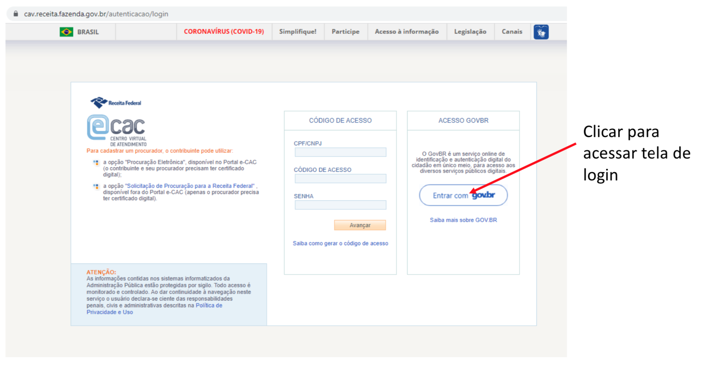
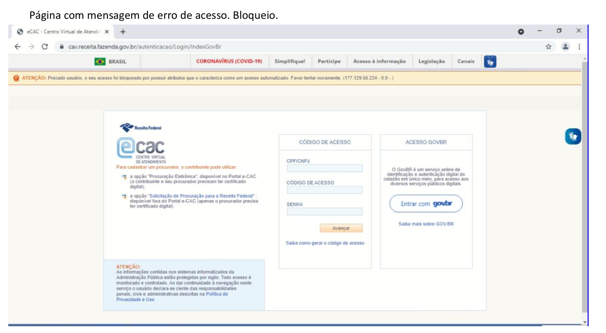

# RPA_project

## Setup

Install pyenv
```
brew update
brew install openssl readline sqlite3 xz zlib
brew install pyenv
```

Install pyenv-virtualenv
```
brew install pyenv-virtualenv
```
Add to ~/.bah_profile  or ~/.zshrc 
```
eval "$(pyenv init -)"
eval "$(pyenv virtualenv-init -)"
```
Restart terminal to start uding Pyenv.

Install Python through Pyenv (currently using python 3.9):
```
pyenv install 3.9.6 
```
Now, create virtual environment:
```
pyenv virtualenv 3.9.6 rpa-env
```

Go into the Project root and set the vritualenv as the default:
```
pyenv local rpa-env
```

Once with the env activated, install requirements:

```
pip install -r requirements.txt
```

To run, first change values in settings.py to locate appropriate driver.
Then,

```

```


## General Info

Bora tentar primeiro burlar esse captcha maldito do [portal e-CAC](https://cav.receita.fazenda.gov.br/autenticacao/login)





##Problema


##Expected


# References

[Selenium IDE for Chrome](https://chrome.google.com/webstore/detail/selenium-ide/mooikfkahbdckldjjndioackbalphokd?hl=en)
